# Doodle Rumble

**Small sticks. Big imaginations. Draw, fight, repeat.**

Doodle Rumble is a hand-drawn 2D arcade fighter for macOS, with an imaginative racing side game. Six hollow-headed doodles throw oversized weapons around a living computer desk while a funny six-battle story climbs from a gentle first fight to Pac-Man, H4CK3R and the Dark lord.

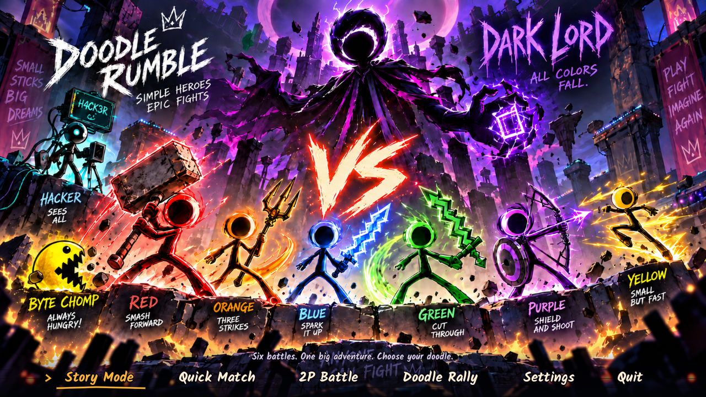

## From my kids' drawing to a playable world

Doodle Rumble started with a drawing my kids made: little stick figures with hollow heads, huge tools, and enough attitude to look as if they were already arguing over who won. I wanted to keep that energy, not tidy it away. The first question was simple: what if these doodles could climb off the page and fight inside the computer they were drawn on?

I built the answer in Godot. The first Mac prototype proved the basics with a desk arena, movement, attacks, health and rematches. Then the kids' characters became a six-fighter cast with distinct specials. The desk became one stop in a bigger, sillier journey through quarries, paper worlds, arcades and a glitching computer core. The story now builds toward Pac-Man, H4CK3R and Dark lord, with each match raising the challenge and giving the doodles another reason to show off.

The art has grown alongside the game. Illustrated backgrounds set the scene; ink-style HUD and oversized effects make the action feel like the drawing is fighting back. The latest character pass uses **individual transparent pose and effect sprites** for all six fighters and three bosses. A small importer trims the source images' transparent safety borders, creates lighter runtime copies, and records each pose's pivot so the characters still meet the floor and their existing hitboxes. These are separate PNGs, rather than a conventional sprite sheet. Godot's fixed-step combat remains independent of the art. The original high-resolution pack images are preserved under `source_art/`.

## How it grew

| Milestone | What changed |
| --- | --- |
| First playable build | Four fighters, a desktop arena, solo play, training, local battles and quick rematches established the game loop. |
| Cast and visual identity | Purple and Yellow joined Orange, Red, Green and Blue. The title poster, hand-drawn HUD, larger attacks and illustrated arenas gave the game its sketchbook-meets-computer look. |
| A journey worth finishing | The six-stage Save Star Saga added Pac-Man, H4CK3R and Dark lord, rising difficulty, hazards, new worlds, stage-specific music, a short ending and small jokes between fights. Doodle Rally became a separate racing side game. |
| A livelier hard setting | The regular color-fighter AI now re-engages quickly after getting hit. On Hard it makes about 31% more attack decisions in a fixed 45-second comparison, moves 10% faster and chooses specials 25% more often. |
| Bringing the drawings closer | Nine transparent art packs now animate the playable cast and bosses in selection, story scenes and combat. The latest pass adds moving idle/run poses, clearer boss attack releases, better-fitting selection previews and visible round-result performances. |
| Making the finale feel final | Pac-Man's runtime poses now keep his single-eye silhouette. Dark lord has eight telegraphed attack patterns, a stronger damage tier, and three new signature hazards with much larger purple effects. |
| Doodle Workshop | Draw or import a paper character, pose its head, body and limbs, preview movement, and choose from six weapon kits. Custom fighters can enter Story, Quick Match, 2P Battle and Practice, with six local save slots and an optional paper-white edge. |
| Latest Workshop tune-up | The starter figure can now change color without recoloring a child's other marks. Imported-photo saves guide players to missing cutout shapes, and **Save fighter** stays in the Workshop while **Save & Fight!** continues to battle. |
| Poster-to-gameplay pass | Fighters are more prominent in the arena, top HUD marks use rougher ink, and opening control prompts fade so the fight owns the screen. Three story worlds now include harmless, scene-themed jump routes. Custom art is cached across selection and combat instead of building both detailed fighters at once. |

The best design test is still the original one: does it feel like the kids' drawing came alive, and do they want another round?

## What is in the game

- Six original fighters: Orange, Red, Green, Blue, Purple and Yellow, plus six local custom-fighter slots.
- Doodle Workshop: draw, erase, pose and animate your own fighter, or bring in a paper photo. Six custom weapon kits, editable source artwork and a white cutout edge that follows the action. New kits include Rubber Chicken's **Cluckquake** and Jumbo Crayon's **Rainbow Ruckus**.
- Distinct basic attacks and specials, including spin arcs, hammer quakes, pixel slashes, block blasts, signal shots and swarm summons.
- Six-stage story ladder: **Blue → Red → Green → Pac-Man → H4CK3R → Dark lord**.
- Story, Quick Match and local 2P Battle, with fighter selection and a separate readable stage-selection page.
- Chill Doodles, Spicy Scribbles and Doodle Mayhem difficulty choices. Computer opponents attack more often and hazards become more active as the challenge rises; the regular color-fighter AI now presses more actively on Hard and no longer adds a long artificial pause after hit-stun.
- Six illustrated arenas with optional hazards, reachable platforms and animated scenery.
- 60-second rounds, best-of-three scoring, damage numbers, cooldown indicators, rematches and celebratory round results.
- Doodle Rally, the separate imaginative racing game, with its own cars, courses, saves and music while sharing settings and controls.

## Screenshots

The gallery contains native 1280×720 captures from the running game. More context is in [`docs/screenshots/README.md`](docs/screenshots/README.md).

| Fighter selection | Stage selection |
| --- | --- |
| 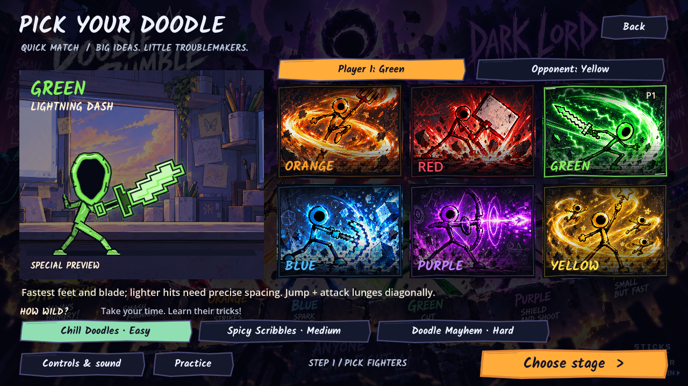 | 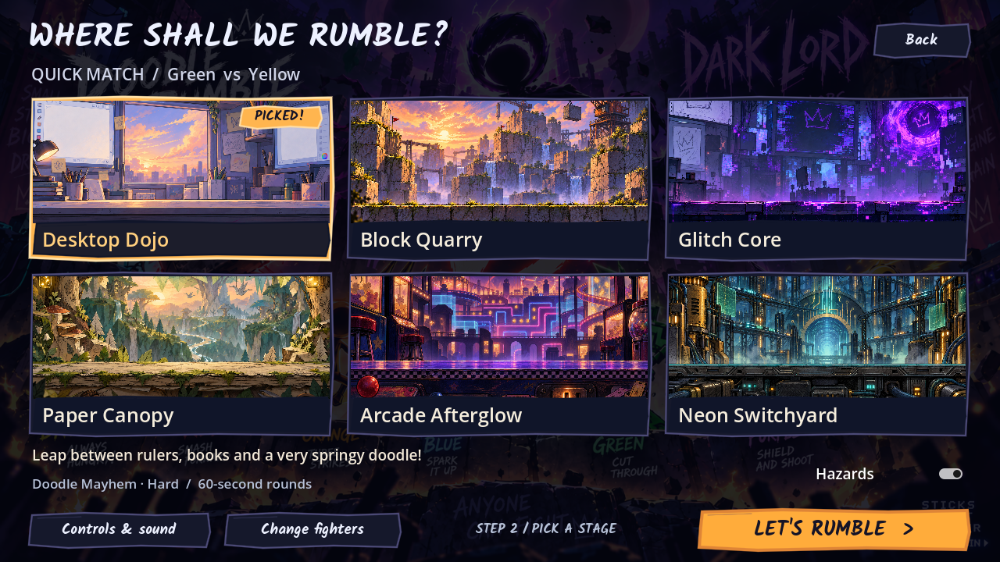 |

| Desktop Dojo combat | Round result |
| --- | --- |
| 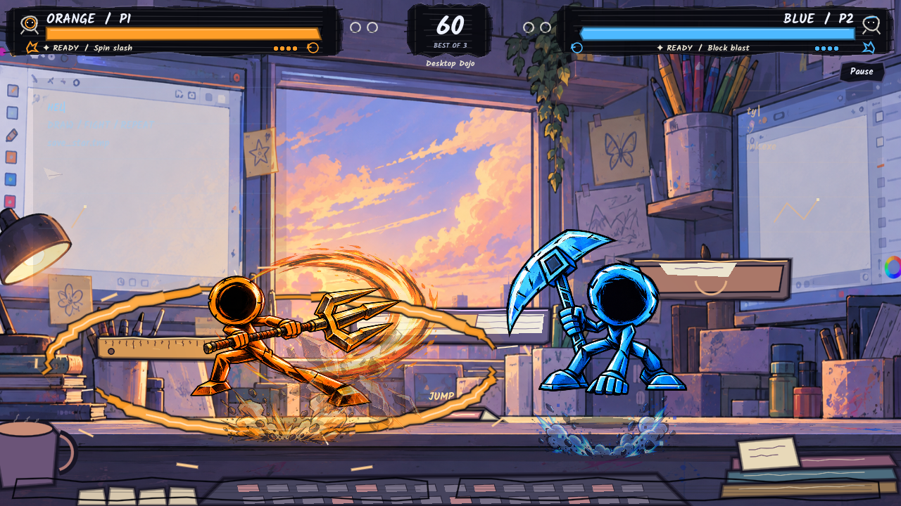 | 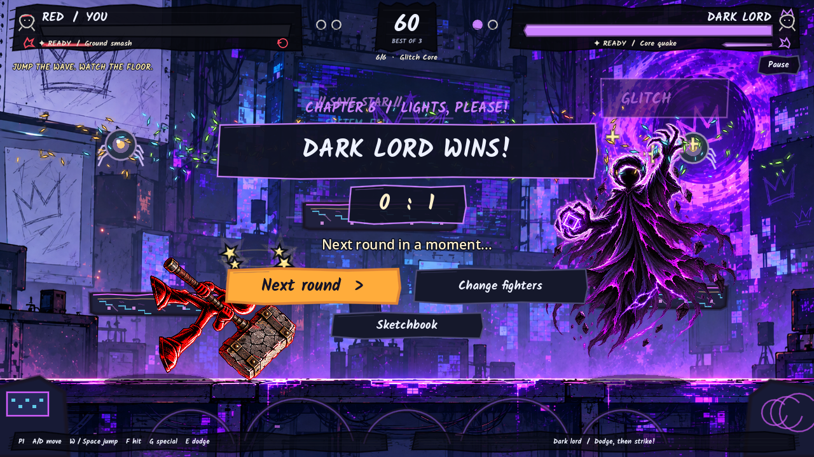 |

| Moving desk scenery | Moving quarry and glitch scenery |
| --- | --- |
| 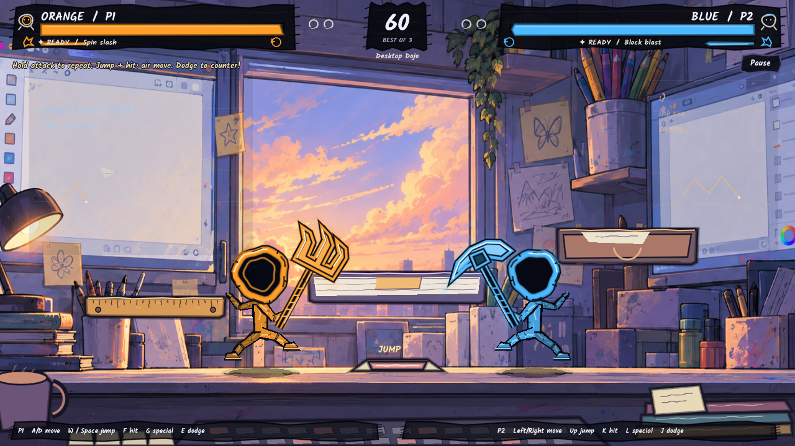 | 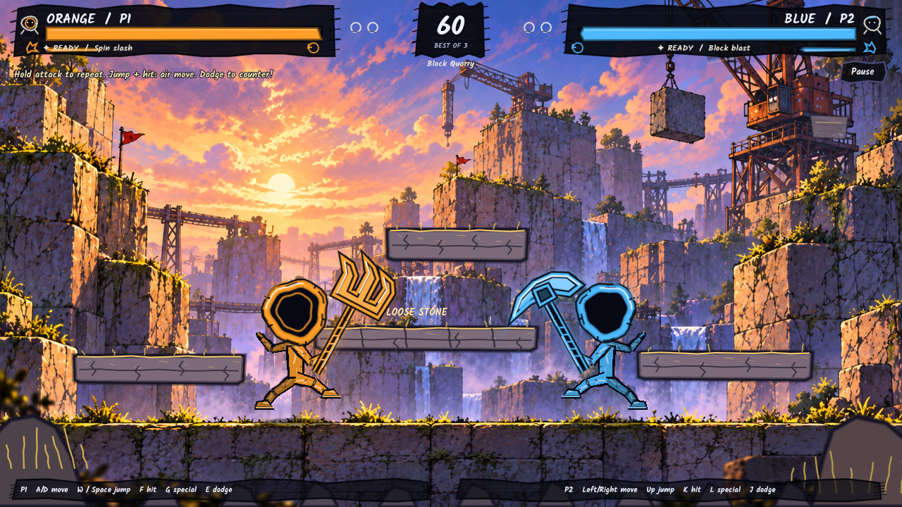 · 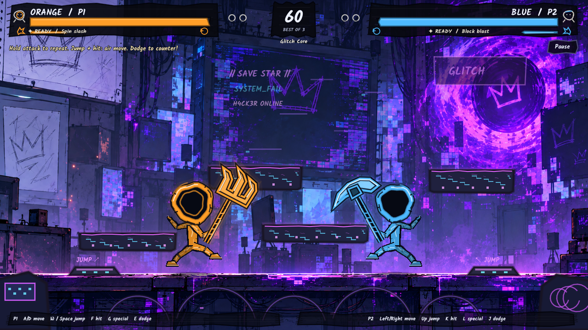 |

### The transparent character art pass

These are native captures from the running Godot project, after the nine new packs were connected to menus and fights.

| Fighter selection | Desktop Dojo fight |
| --- | --- |
| 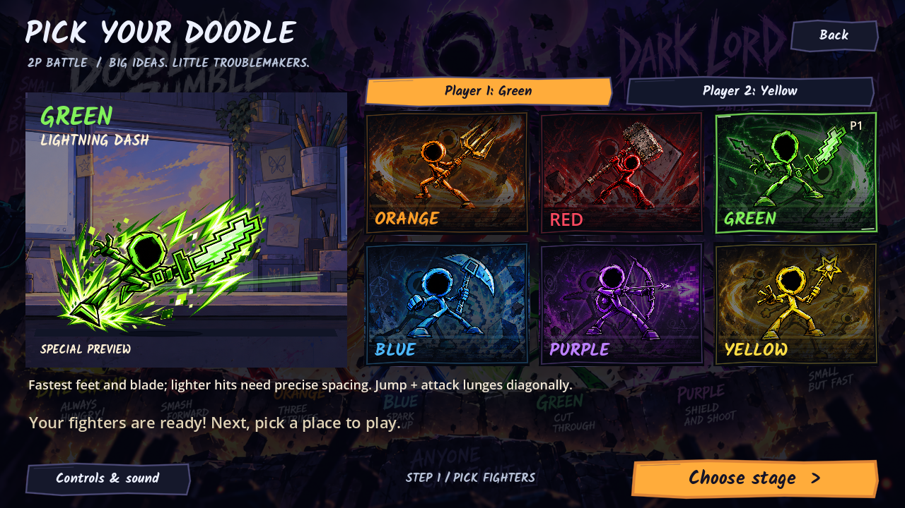 | 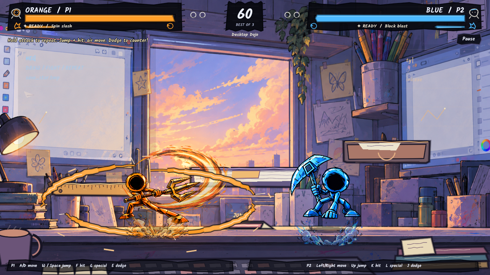 |

| Pac-Man | H4CK3R | Dark lord |
| --- | --- | --- |
| 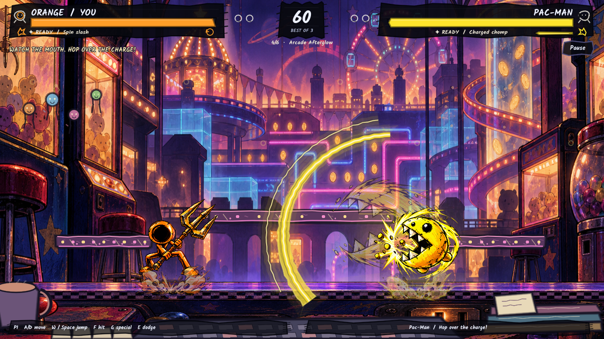 | 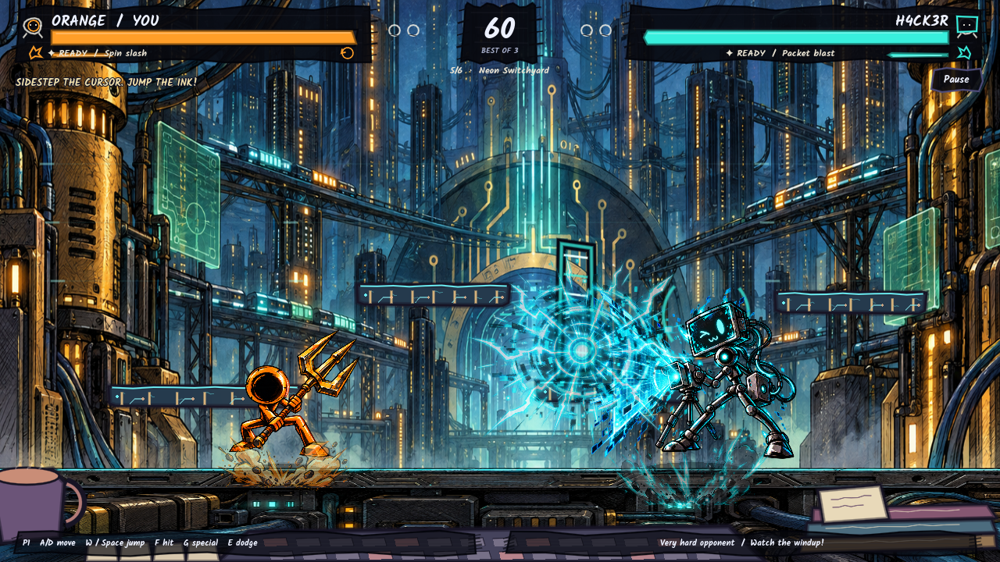 | 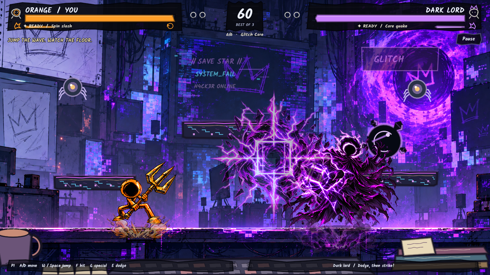 |

## Play on a Mac

The **v0.7.6** source and matching Mac build include the Doodle Workshop, six custom weapon kits, platform-aware specials, and the latest visual/performance pass. Custom character art is cached as articulated pieces and reused between selection and matches. The Mac download and complete Godot project are available from the [v0.7.6 GitHub release](https://github.com/manynames3/doodle-rumble/releases/tag/v0.7.6). See the [v0.7.6 verification report](docs/TESTING_0_7_6.md) or run the project in Godot 4.7.2.

Download and extract `Doodle_Rumble_Mac_v0.7.6.zip`, then double-click **Doodle Rumble.app**. The BenJam Games logo appears briefly before the title menu. Choose **Story Mode**, **Quick Match**, **2P Battle** or **Doodle Rally**. Orange and a gentle opponent are ready by default. The separate `Doodle_Rumble_Project_v0.7.6.zip` contains the complete Godot project for editing or running from source.

This Universal arm64/x86_64 build is ad-hoc signed and not Apple-notarized. macOS may require **System Settings → Privacy & Security → Open Anyway** after a transfer.

## Run from source

1. Install standard **Godot 4.7.2**; the .NET edition is unnecessary.
2. Import `game/project.godot` in the Godot Project Manager.
3. Press **F6** for the current scene or **F5** to run the project.

The project has no add-ons, external accounts or runtime package dependencies. `game/` contains the playable source, scenes and runtime assets. Build/export notes are in [`docs/RELEASE_BUILD.md`](docs/RELEASE_BUILD.md).

## Draw your own fighter

In fighter selection, open **My Doodles → Draw a fighter**. Draw or import a paper photo, bring the parts to life, choose a weapon, then **Try in Practice** or **Save & Fight**. Everything stays on the Mac. Photo cleanup and joint placement are assisted steps; complicated drawings may need an adult’s help. See the [workshop guide](docs/DOODLE_WORKSHOP.md).

### Workshop in the running game

| My Doodles | A paper fighter in battle |
| --- | --- |
| 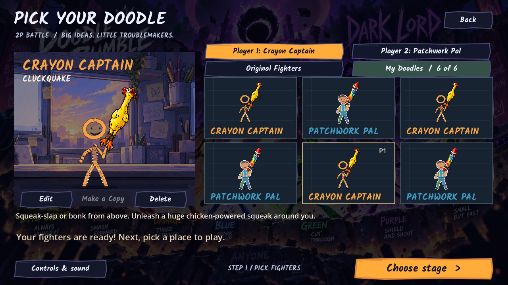 | 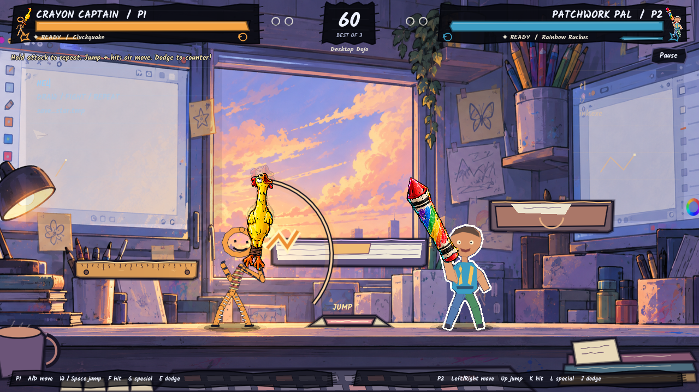 |

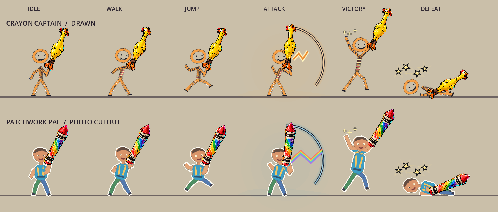

The v0.7.4 special-attack capture shows Cluckquake and Rainbow Ruckus on different Desktop Dojo platforms:

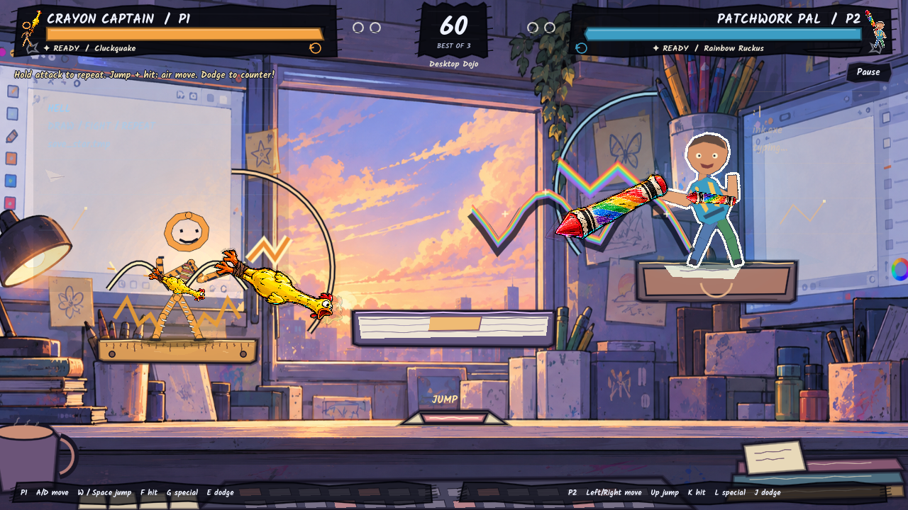

These captures use authored QA drawings. Imported art is cut into movable parts; its colors are preserved, and the thin white perimeter is rebuilt around the combined pose. No cloud service generates a replacement for the child's picture. See the [Workshop capture notes](docs/screenshots/README.md) for the image set.

## Controls

| Action | Player 1 | Player 2 |
| --- | --- | --- |
| Move | A / D | Left / Right |
| Jump | W or Space | Up |
| Attack | F | K |
| Special | G | L |
| Dodge / Purple guard | E | J |
| Pause | Esc | Esc |

Settings supports remapping, available controllers, music/effects volume, reduced motion and hold-to-attack. Gamepads use the left stick/D-pad, south button to jump, west to attack, east to special, left shoulder to dodge/guard and Start to pause.

## Tech stack

| Area | Implementation |
| --- | --- |
| Engine | Godot 4.7.2, GDScript, Compatibility renderer |
| Gameplay | Fixed 60 Hz physics, reusable fighter/weapon data, deterministic hit phases, recovery protection and shared AI controllers |
| Rendering | 2D `Node2D`/`CanvasItem` drawing, individual transparent RGBA pose/effect sprites with measured pivots, procedural ink/VFX fallbacks, layered PNG arena paintings, glows, shadows and animated UI |
| Asset pipeline | Pillow build script preserves 306 original PNGs outside Godot and creates 155 trimmed runtime copies with per-pose pivot metadata; no Python dependency is needed to play |
| Doodle Workshop | Editable stroke layers and imported photo cutouts, shared joint animation, composited alpha-outline shader, atomic local saves and macOS HEIC conversion |
| Audio | Original synthesized WAV battle loops and sound effects, context crossfades, separate story/racing music and shared volume settings |
| Ending | Godot-authored storyboard with Ogg Theora/Vorbis playback |
| Platform | macOS Universal export for Apple Silicon and Intel |
| QA | Godot GDScript suites, isolated preference profiles, native 1280×720 captures and exported-PCK checks |

## Validation

Workshop verification covers library recovery, kit combat, custom-versus-custom selection, story continuation, local photo import and the animated paper perimeter. Native captures and measured rendering checks are recorded separately from headless logic tests. These source changes are pushed to GitHub; no new downloadable release is created by this update.

See [`BUILD_STATUS.md`](BUILD_STATUS.md) for the current feature and limitation list and [`docs/TESTING_0_7_6.md`](docs/TESTING_0_7_6.md) for the latest test evidence. The project owner reports that family playtesting is complete; physical controller behavior, Intel execution, transferred first launch and external audio hardware still need verification.

## Repository map

```text
game/                 Godot project, scripts, scenes, assets and tests
source_art/           Untouched originals from all nine packs plus Pac-Man eye-correction source art
docs/screenshots/     Curated public gameplay gallery
docs/                 Build, testing, audio, ending and provenance notes
```

The original private family drawing and planning files are intentionally excluded from the public repository. The nine owner-supplied transparent **production** packs are included, with their original PNGs preserved under `source_art/` and their use documented in [`docs/CHARACTER_PACK_MAPPING.md`](docs/CHARACTER_PACK_MAPPING.md). Origins plus third-party notices are in [`docs/ASSET_PROVENANCE.md`](docs/ASSET_PROVENANCE.md). The Doodle Rumble name, characters, art, audio and other creative assets remain reserved; this public repository is provided for viewing and play unless a separate license is granted.
